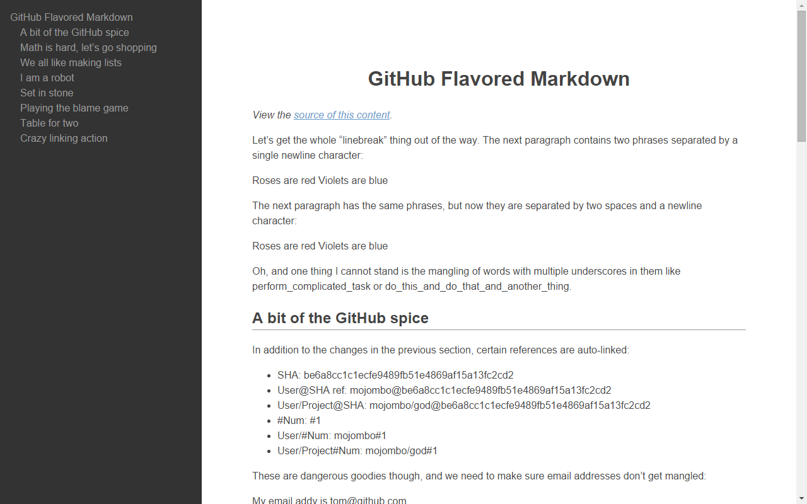

# Markdown Viewer

A chrome extension to preview the Markdown.

## Install

Coming soon...

## Usage

When you open the Markdown file in a browser, the preview appears.

## Contribution

1. Fork it
2. Create your feature branch
3. Commit your changes
4. Push to the branch
5. Create new Pull Request

## Authors

* [YAMADA Koji](https://github.com/kou64yama)
